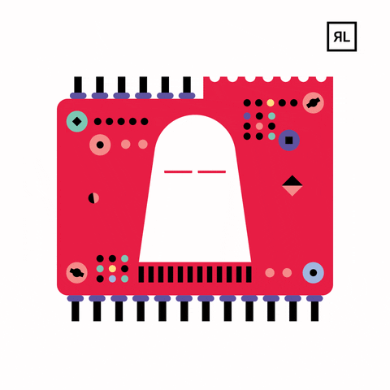

<h1 align="center">Hi H4x0rs 💻, I'm Victor(H1j4ck3dH4ck)</h1>
<h3 align="center">Actually studying programming at 42BCN</h3>

- 💻 I’m currently working on [ft_printf](https://github.com/H1j4ck3dH4ck/42_cursus/tree/main/Ft_printf)

- 💻 I’m currently learning **c, c++, python, linux, kali linux**

- 📫 How to reach me **victormunozrodriguez1994@gmail.com**

<h3 align="left">Connect with me:</h3>

<h3 align="left">Languages and Tools:</h3>

            

